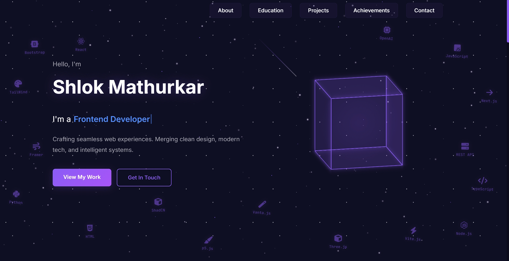

# 🚀 BuildFolio — Retro Cyberpunk Portfolio

> **“Your skills deserve a stage—this is it.”**

A **vibrant, modern portfolio** fusing **cyberpunk aesthetics** with **smooth animations**, **3D visuals**, and a **professional layout** — crafted to leave a lasting impression.

---

## ✨ Highlights

🎨 **Design & Theme**
- 🌌 Cyberpunk Purple Palette with **Glassmorphism Glow**
- 🌠 **Animated Starfield & Meteor Showers** in the background
- 💫 **Aurora-like Header Effects** with modern typography

🚀 **Interactivity**
- 🧊 **3D Rotating Cube** with dynamic energy effects
- ⌨️ **Typing Role Animation** (Frontend Developer, AI Enthusiast…)
- 🛸 **Floating Tech Stack Icons** (React, Node.js, Python, etc.)
- 🔗 **Quick Social Media Access**

---

## 🌐 Live Demo

👉 **[View the Live Website Here](https://portfolio-woad-eight-41.vercel.app/)**

---

## 🖥️ Responsive Sections Breakdown

🏠 **Hero Section** – Vibrant intro with animated text and 3D cube  
🙋‍♂️ **About Me** – Floating tech icons and quick highlights  
📁 **Projects** – Frosted glass cards with hover animations  
🎓 **Education Timeline** – Fluid, milestone-driven layout  
🏆 **Achievements** – Rotating achievement spotlights  
📩 **Contact** – Clean and interactive contact form

---

## ⚙️ Tech Stack

Built with:
- **HTML5**, **CSS3**, **JavaScript**
- **Three.js** for interactive 3D
- **Framer Motion** for animation finesse
- **Font Awesome** for crisp icons
- **Fully responsive**, mobile-friendly design

---

## 📈 What’s Next — Roadmap

🚧 Upcoming Upgrades:
- 📝 **Personal Blog Integration**
- 🌗 **Dark/Light Mode Toggle**
- 🎬 **Optional Video Backgrounds**
- 🗂️ **Advanced Project Filtering**
- 📨 **Interactive Notification System**
- 📱 **Enhanced Mobile UX with touch gestures**

---

## 🎉 Final Words

> *“This portfolio isn’t just a showcase—it's a mirror of my journey and aspirations.”*

Thank you for visiting! 🚀  
**Let’s create something unforgettable!**
